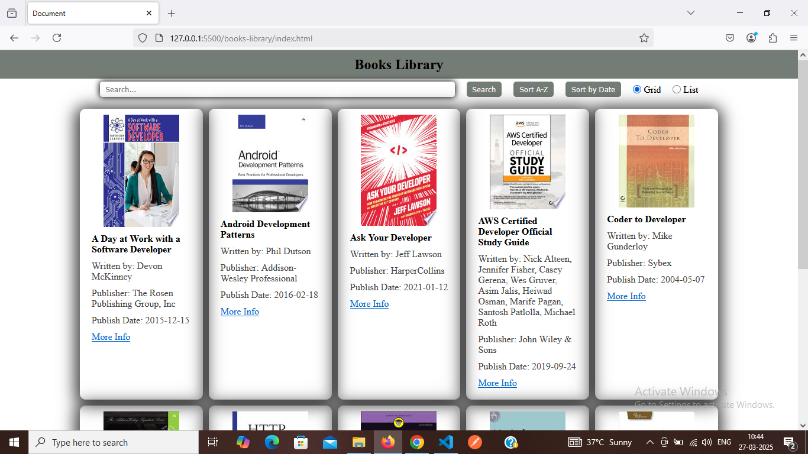

# Books Library

# Feature

1. Fetch books from the API and display them as a list/grid
    - Provide an option to user to switch between the viewing type of list v/s grid
    
2. Show book details including title, author, publisher, published date, and thumbnail
3. Implement a search bar to filter books by title or author

4. Implement a sort feature to list books in Alphabetical order based on their title, date of release (publishedDate)
5. Implement pagination on reaching the end of the page to call next set of details
6. Clicking on a book item, should open more details in a new tab (using infoLink)

# Screenshot

## Deployment link
[here]()