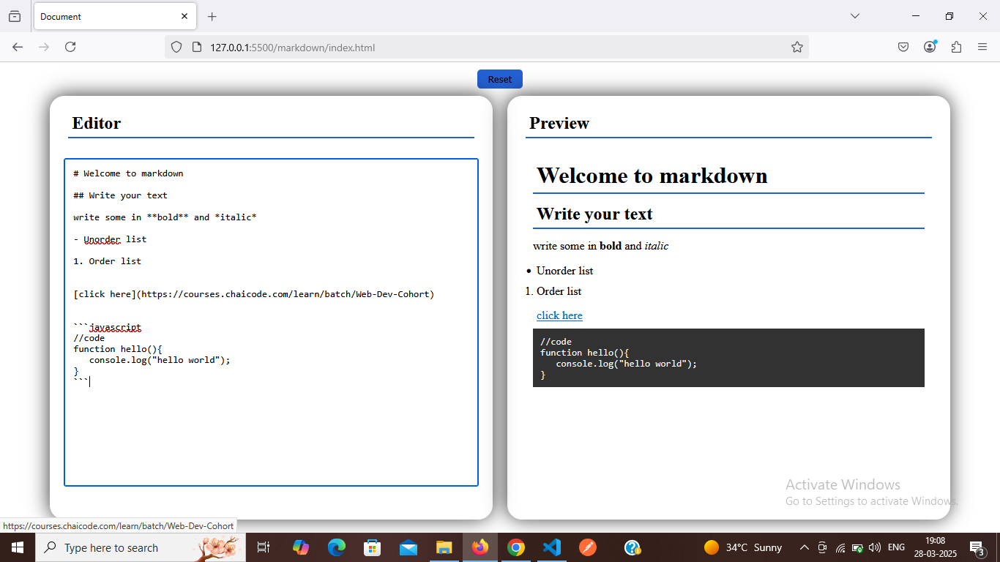

# Markdown Previewer

## Features

1. A textarea where users can type Markdown syntax (on left-hand side)
2. A preview section that displays the formatted output in real time (on right-hand side)
3. Support for basic Markdown elements like:
    - Headings (# H1, ## H2, etc.)
    - Bold & Italics (**bold**, italic)
    - Links ([title](http://example.com))
    - Lists (ordered and unordered)
4. A clear/reset button to clear the textarea
5. BONUS:
    - To handle code blocks (inline and multi-line) with highlighting code blocks


# Screenshots 


# Deplyoyed link
[here](https://arjunsingpardeshi.github.io/masterji-project/markdown)


### input data to check mardown preview is given below you just need to copy and paste

# Welcome to markdown

## Write your text

write some in **bold** and *italic*

- Unorder list

1. Order list


[click here](https://courses.chaicode.com/learn/batch/Web-Dev-Cohort)


```javascript
//code
function hello(){
   console.log("hello world");
}
```